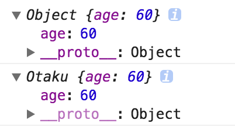

# 004 模拟实现 new

## 实现

根据 MDN 文档的描述，`new` 关键字主要做了以下四点工作：

1. 创建一个空的简单 JavaScript 对象（即 `{}`）；
2. 链接该对象（即设置该对象的构造函数）到另一个对象；
3. 将步骤 1 新创建的对象作为 `this` 的上下文；
4. 如果该函数没有返回对象，则返回 `this`。

下面先拿冴羽大佬博客原文的代码来分析。

```js
function objectFactory () {
  // 对应 1：创建一个空对象
  var obj = new Object(),
  // 第一个实参为构造函数，提取之
  Constructor = [].shift.call(arguments)
  // 对应 2：实例对象之所以能取到构造函数原型对象中的值
  // 就是因为实例对象中有一个 __proto__ 属性，里面保存了构造函数的原型对象
  obj.__proto__ = Constructor.prototype
  // 对应 3：使用 new 创建实例对象时，构造函数中的 this 会指向新的实例对象
  // 这样实例对象就可以访问到构造函数中使用 this.xxx 定义的属性
  var ret = Constructor.apply(obj, arguments)
  // 对应 4：如果构造函数有返回值，且返回值为对象，则返回构造函数的返回值
  // 否则，返回生成的实例对象
  return typeof ret === 'object' ? ret : obj
}
```

## 争论

在这篇博文下有不少争论的点，归纳如下：

1. 第一步创建一个空对象中，有同学认为既然是在模拟 `new`，那么在函数内部还使用 `new` 去创建一个新对象貌似不太合理，那么这一步的功能就衍生了几种做法：

```js
// 创建一个新的空对象
var obj = {} // √
var obj = Object.create({}) // √
var obj = Object.create(Constructor.prototype) // √
var obj = Object.create(null) // ×
```

其中前三种方式，模拟函数都是能正常运行的，甚至直接使用构造函数的 `prototype` 来创建对象，也能获取正确的结果，但 `var obj = Object.create(null)` 则会导致 `prototype` 中定义的东西全部都无法获取。这个问题博主在其中一条回复中做过解释：

> 如果使用 Object.create(null)，person.sayHello 就会报错，使用 new Object()，会正常打印 hello。<br>
> 查看由两种方式生成的 person 对象，第一个是由 Object.create 生成的，第二个是 new Object 生成的<br>
> <br>
> 两者的区别就在于 \_\_proto\_\_ 一个是实的，一个是虚的，由此我们可以猜测第一种方式是把 \_\_proto\_\_ 当成了一个属性值，而非去修改了原型！<br>
> 原因其实在 《JavaScript深入之从原型到原型链》中有提过：<br>
> \_\_proto\_\_ ，绝大部分浏览器都支持这个非标准的方法访问原型，然而它并不存在于 Person.prototype 中，实际上，它是来自于 Object.prototype，与其说是一个属性，不如说是一个 getter/setter，当使用 obj.\_\_proto\_\_ 时，可以理解成返回了 Object.getPrototypeOf(obj)。

1. 第四点中 `typeof ret === 'object'` 无法覆盖所有会返回构造函数返回值的情况，比如返回的如果是数组、函数，在 `new` 中也会返回构造函数返回值，同样列举评论中见到的几种判断是否返回构造函数返回值的方法：

```js
// 判断是否返回构造函数的返回值

```

::: tip 部分参考来源
[JavaScript 深入之 new 的模拟实现](https://github.com/mqyqingfeng/Blog/issues/13)
:::
