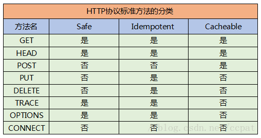
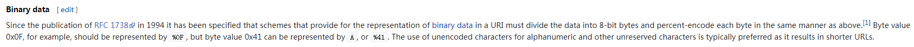

# 002 HTTP 请求方法

## 标准方法

**GET** 通常用于请求服务器发送某个资源

**HEAD** 与 GET 很相似，但在返回时只返回响应头，可以用于在不获取资源的情况下了解资源的情况

**PUT** 在 RESTful 风格的接口中，PUT 一般代表修改内容

**POST** 在 RESTful 风格的接口中，POST 一般代表新增内容

**TRACE** 一般用于发送一个诊断请求，验证请求是否穿过了完整的请求/响应链。一般可以用 [Via](https://developer.mozilla.org/zh-CN/docs/Web/HTTP/Headers/Via) 头部标识请求/响应的过程

**OPTIONS** 一般在发起跨域请求时出现，用于确认服务器允许的请求方法

**DELETE** 一般用于删除资源，它在

**CONNECT** 可以用来创建“隧道”，访问启用了 HTTPS 的站点

截止 HTTP/1.1 第三版（[RFC 7231](https://tools.ietf.org/html/rfc7231)），标准的请求方法只包括上述的 8 个。此外，如果HTTP服务端接收到一个已经实现，但不能被用于相应的资源的请求方法，需要返回错误码 **405 Method Not Allowed** 如果 HTTP 服务端接收到一个未知的方法，则需要返回错误码 **501 Not Implemented**

## 扩展方法

HTTP 被设计成字段可扩展的形式，以扩展一些新的特性，如在 RFC 2518 发布的 [WebDAV 扩展协议](https://zh.wikipedia.org/wiki/%E5%9F%BA%E4%BA%8EWeb%E7%9A%84%E5%88%86%E5%B8%83%E5%BC%8F%E7%BC%96%E5%86%99%E5%92%8C%E7%89%88%E6%9C%AC%E6%8E%A7%E5%88%B6)，就定义了 PROPFIND、PROPPATCH、MKCOL、COPY、MOVE、LOCK、UNLOCK 七个新方法，并对标准方法 DELETE、PUT、OPTIONS 做了一些修改。

## 请求方法的属性

在 RFC 2068 中，讨论了请求方法的两类属性，安全性和幂等性，在 RFC 7231 中，又增加了方法的可缓存性。

### 安全的方法（Safe Methods）

说到安全，一般都会想到保护数据不被窃取，保证系统不被攻击，但这里安全的含义并不是这样。一个安全的请求方法，指的是这个方法在语义上是只读的，它不会对服务器产生任何预期修改。这里对安全方法的定义特别强调了它是一个语义上的安全，区别于实现安全。

根据上述定义，GET、HEAD、OPTIONS 和 TRACE 方法被认为是安全的方法，其他方法则被认为是不安全的。

区分安全不安全的请求方法的主要目的在于，让网络爬虫和网页预加载程序能够安心工作，不用担心会造成什么危害。此外，它能够让浏览器在访问一些不被信任的页面时，对网页中执行的不安全的请求方法采取一定的策略来限制它们的活动。浏览器需要能够区分出不安全的请求，让用户能够在这些请求被提交之前，意识到可能存在的风险。

### 幂等的方法（Idempotent Methods）

在 [RFC 7231](https://tools.ietf.org/html/rfc7231#section-4.2.2) 中定义：使用该方法发送多次与单次请求，在服务器上的预期效果是相同的，则请求方法被视为“幂等”。在该规范定义的请求方法中，PUT、DELETE 和安全请求的四种方法都是幂等的。

区分幂等操作的意义在于，当客户端发送一条请求后，在获取服务器响应前出现连接错误导致无法确定本次请求是否成功时，可以安全的再次重复这次请求，而不用担心会产生什么副作用。

### 可缓存的方法（Cacheable Methods）

可缓存的请求方法指的是该方法对应的响应消息能够在客户端被存储，并在之后的请求中被直接使用，而不再需要从服务端重新获取。可缓存的方法有 GET、HEAD 和 POST，但大部分的实现中都只支持 GET 和 HEAD 的缓存。

### 标准请求方法的属性

根据上述定义，可以得到如下 HTTP 协议标准请求方法的分类表格。


> 图：标准请求方法的属性

## GET 和 POST 的区别

### 浏览器所发出的非 Ajax 请求

**功能**：GET 请求用于读取一个 html 页面 / 图片 / css / js 等资源，POST 请求则是出现在点击 &lt;form&gt; 表单中的 submit 按钮提交资源时发出。

**请求参数**：GET 的请求参数只能放在 URL 中的查询字符串里，POST 的参数只能放在 body 请求体中。

**MIME 类型**：GET 可以是 text/html、text/css 等等，取决于获取资源的类型，POST 请求则有两种，application/x-www-form-urlencoded 一般用于传递 key-value 结构的表单数据，multipart/form-data 主要用于传输文件。不采用 application/x-www-form-urlencoded 传输文件的原因是它的编码方式对于文件这种二进制的数据非常低效。

**缓存**：由于 GET 的语义是读取资源，浏览器会对 GET 请求做缓存，而 POST 请求在语义上会对服务器资源作出修改，浏览器则不会进行缓存，否则如果一个 POST 命中了缓存，返回了操作成功，而服务器实际上又没有接收到请求，更没有对服务器资源作出应有的修改，这就犯了大错了。

**安全性**：GET 请求在语义上属于安全的请求方法，POST 则不是。

场景：浏览器的书签只能发送 GET 请求，试想，假如把一个购买的逻辑实现为了 GET 请求，那么如果有人把这段链接加入了书签，那么点击一次书签就可以下一单，非常危险。

**幂等性**：GET 请求在语义上是幂等的，POST 则不是。

虽然 POST 在语义上不是幂等的，但是将一个 POST 请求实现为幂等很有意义。

场景：如果有一个 POST 请求单纯的实现了添加数据的功能，如果前端在请求这个接口时出现了某些问题造成了重复提交，这时服务端就处于完全没有防护的状态，任由前端提交的数据宰割。

如果将 POST 实现为幂等，比如使用一些字段去鉴定当前提交是否属于重复提交，在服务端做一层防护，就可以提高数据的安全性。但如何实现才是幂等，主要还是取决于具体的业务需求。

### Ajax 请求

对于使用 Ajax 相关 API 发起的 HTTP 请求，原则上是非常自由，没有任何限制的，只要满足下述的 HTTP 报文结构，就都可以发送：

```
<METHOD> <URL> HTTP/1.1\r\n
<Header1>: <HeaderValue1>\r\n
<Header2>: <HeaderValue2>\r\n
...
<HeaderN>: <HeaderValueN>\r\n
\r\n
<Body Data....>
```

也就是说，既可以在 GET 请求中携带请求体，也可以在 POST 中随意添加查询字符串。

但过于自由会带来缺乏规范的问题，因此诞生了 REST 等约束接口风格的范式。

### 安全性

#### 从攻击的角度看

无论是 GET 还是 POST 都是不安全的，因为 HTTP/1.1 本质上是一个明文传输的协议（HTTP/2 采用二进制流传输），也就是说 HTTP 报文的所有内容都是在网络上裸奔。为了避免传输中数据被窃取，必须做从客户端到服务器的端端加密。业界的常用做法就是 HTTPS——即用 SSL 协议协商出的密钥加密明文 HTTP 数据的方案。

#### 从 HTTP 本身看

GET 请求更倾向于把请求参数带在 URL 上，因此确实存在更高的数据泄漏的风险，比如在服务器日志中一般会记录一个请求的完整 URL，这时运维人员就能看到 GET 请求携带的所有参数信息，这对信息安全是不利的，即使没有将信息泄漏给第三方。因此对于传输私密信息 POST + body 通常是更好的选择。

#### 总结

安全是一个巨大的主题，GET 与 POST 的选择在其中只占极小的一部分而已，因此通常使用中只需要记住私密传输使用 POST + body 就够了。

### 编码

> 上文已经说明了，HTTP 请求只要满足报文结构，就可以发送，与请求方法无关，因此这里的描述就不能再笼统的用 GET 和 POST 区分了。

在 URL 中发送请求参数，与在 body 中发送请求参数，编码格式的要求是不同的：

#### URL

[RFC 1738](https://www.ietf.org/rfc/rfc1738.txt) 中要求 URL 只能支持字母、数字、规范中指定的特殊字符“$-_.+!*'(),”以及某些特殊的保留字进行未经编码的使用，其它字符都被视为“不安全”的，需要进行编码。

URL 编码采用的是一种叫做 [Percent Encoding](https://en.wikipedia.org/wiki/Percent-encoding) 的方式，它会将需要编码的字符根据字符集编码进行解码，比如根据 UTF-8 进行解码，字符就会转化为 % 和 16 进制数组成的字符串。

根据 [Percent Encoding](https://en.wikipedia.org/wiki/Percent-encoding) 中的解释，URL 甚至可以传递二进制数据（binary data）：


> 图：Percent Encoding 支持编码二进制数据

#### body

body 中内容的格式规范相对更明确，可以通过 `Content-Type` 头部定义请求体的格式和字符编码，如：`Content-Type: application/json; utf-8`。

body 中可以传输任意格式的二进制数据（binary data）。

#### 总结

POST 通常使用 body 进行传输，body 中的格式规范更严谨一些，相对不容易出错。GET 请求通常使用 URL 传参，URL 虽然也支持传输编码后的二进制数据，但是 URL 却有长度的限制。事实上，超长的 URL 会带来诸多不便，比如难以分析的请求体；超长的日志信息；有些爬虫甚至无法处理超过 2000 字节的 URL 等等。

因此，在传输体积较大的数据时，还是应该在 body 中进行传输。

### POST 的两次请求问题

有些浏览器会在发送 POST 请求之前先发起一个带有 **100 Continue** 期望的请求，这个请求中只带有头信息，目的是确认服务端是否能够接收后续的内容，当收到服务端的 **100 Continue** 确认信息之后，才会把剩下的请求体发过去。

究其原因，其实还是 POST 的语义问题，POST 常用于向服务端发送数据，通常会有使用 POST 方法发送体积巨大的文件的场景，那么有些浏览器针对这种语义特征对 POST 请求进行了优化，即先发送请求头，向浏览器询问是否能处理大文件，避免直接把整个请求体发过去，浪费了服务端的解析资源。最后在得到浏览器同意的情况下，再将 body 发给服务器进行解析。

本质上这是浏览器对 POST 请求进行的优化，并不是所有的浏览器都进行了这样的优化。如果从 HTTP 的角度说这是 GET 方法和 POST 方法的区别是不严谨的。这也是前文一直强调的，HTTP 的请求方法都只有语义上的区别，实际情况还是与客户端的具体实现有关。

::: tip 部分参考来源
[HTTP协议漫谈 - HTTP协议请求方法](https://blog.csdn.net/ccpat/article/details/79463473)

[GET 和 POST 到底有什么区别？](https://www.zhihu.com/question/28586791)
:::
