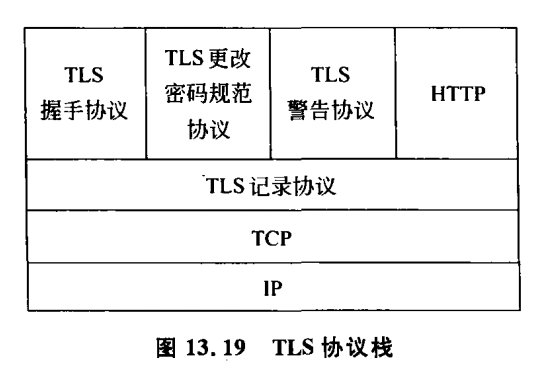

# 006 HTTPS

## 概述

HTTP 是一个明文传输的协议，HTTP 传输总是冒着被第三方截获报文的风险。

HTTPS 就是在 HTTP 和 TCP 协议中间加入了 SSL/TLS 安全套接层。它结合非对称加密和对称加密的各自优点，配合证书。既保证了安全性，也保证了传输效率。

## 历史

* **SSL 2.0（1995）**：由 Netscape 提出，这个版本由于设计缺陷，并不安全，很快被发现有严重漏洞，已经废弃
* **SSL 3.0（1996）**：写成 RFC，开始流行。目前已经不安全，必须禁用
* **TLS 1.0（1999）**：互联网标准化组织 ISOC 接替 NetScape 公司，发布了 SSL 的升级版 TLS 1.0 版
* **TLS 1.1（2006）**：作为 RFC 4346 发布。主要修复了 CBC 模式相关的如 BEAST 攻击等漏洞
* **TLS 1.2（2008）**：作为 RFC 5246 发布。增进安全性。目前应该主要部署的版本，请确保你使用的是这个版本
* **TLS 1.3（2018）**：作为 RFC 8446 发布。支持 0-RTT，大幅增进安全性，砍掉了 AEAD 之外的加密方式

由于 SSL 的 2 个版本都已经退出历史舞台了，所以一般所说的 SSL 就是 TLS，所以本文后面将会只用 TLS 这个名字。

另外，TLS 1.2 是现在的主流版本，所以后文的介绍会基于 TLS 1.2 来进行，关于 [TLS 1.3 的改进，将会放在另一篇文章说明](/network/008.md)。

## TLS 协议分层

TLS 是用来做加密数据传输的，因此必须有一个对所有消息进行加密传输的对称加密传输组件，这就是记录协议：

1. **记录协议（Record Protocol）**：负责对消息进行对称加密传输

它在 TLS 协议分层中被称为**低层（Low Layer）协议**。

而为了给这个组件生成双方共享的密钥，就需要有一个认证密钥协商组件，这就是握手协议：

2. **握手协议（Handshake Protocol）**：负责密钥协商

还有 3 个很简单的辅助协议：

3. **密钥交换协议（ChangeCipherSpec Protocol）**：用来通知对端从 Handshake 切换到 Record 协议（有点冗余，在 TLS 1.3 里面已经被删掉了）
4. **警告协议（Alter Protocol）**：用来通知各种返回码
5. **程序数据协议（Application Data Protocol）**：把传输层的数据流传入 Record 层做处理并传输

上述 4 个协议在 TLS 协议分层中合称为**高层（High Layer）协议**。

这 5 个协议中，Record 协议在 TCP 流上提供分包，也就是说，最终其他四个协议的包内容，以及 HTTP 传输的内容，都会被封装在 Record 协议的包里在 TCP 上传输，如下图：

> 图：TLS 协议分层

下面讲一讲每个协议具体做了什么。

## 记录协议（Record Protocol）
## 握手协议（Handshake Protocol）
## 密钥交换协议（ChangeCipherSpec Protocol）
## 警告协议（Alter Protocol）
## 程序数据协议（Application Data Protocol）

::: tip 部分参考来源
[TLS1.2 握手的过程是怎样的？](http://47.98.159.95/my_blog/http/015.html)

[TLS 协议分析 与 现代加密通信协议设计](https://blog.helong.info/post/2015/09/06/tls-protocol-analysis-and-crypto-protocol-design/)
:::
