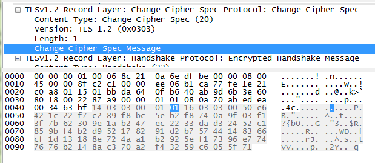
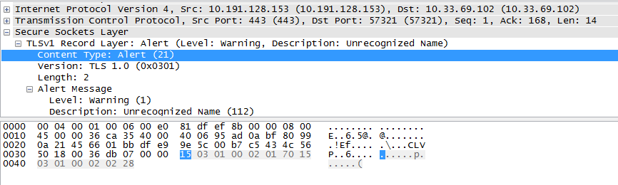

# 006 HTTPS

## 概述

HTTP 是一个明文传输的协议，HTTP 传输总是冒着被第三方截获报文的风险。

HTTPS 就是在 HTTP 和 TCP 协议中间加入了 SSL/TLS 安全套接层。它结合非对称加密和对称加密的各自优点，配合证书。既保证了安全性，也保证了传输效率。

## 历史

* **SSL 2.0（1995）**：由 Netscape 提出，这个版本由于设计缺陷，并不安全，很快被发现有严重漏洞，已经废弃
* **SSL 3.0（1996）**：写成 RFC，开始流行。目前已经不安全，必须禁用
* **TLS 1.0（1999）**：互联网标准化组织 ISOC 接替 NetScape 公司，发布了 SSL 的升级版 TLS 1.0 版
* **TLS 1.1（2006）**：作为 RFC 4346 发布。主要修复了 CBC 模式相关的如 BEAST 攻击等漏洞
* **TLS 1.2（2008）**：作为 RFC 5246 发布。增进安全性。目前应该主要部署的版本，请确保你使用的是这个版本
* **TLS 1.3（2018）**：作为 RFC 8446 发布。支持 0-RTT，大幅增进安全性，砍掉了 AEAD 之外的加密方式

由于 SSL 的 2 个版本都已经退出历史舞台了，所以一般所说的 SSL 就是 TLS，所以本文后面将会只用 TLS 这个名字。

另外，TLS 1.2 是现在的主流版本，所以后文的介绍会基于 TLS 1.2 来进行，关于 [TLS 1.3 的改进，将会放在另一篇文章说明](/network/008.md)。

## TLS 协议分层

TLS 是用来做加密数据传输的，因此必须有一个对所有消息进行加密传输的对称加密传输组件，这就是记录协议：

1. **记录协议（Record Protocol）**：负责对消息进行对称加密传输

记录协议组成了 TLS 的记录层（Record Layer），而为什么 TLS 协议在概念上需要分层呢？这个原因会在后面解释。

为了给记录层的加密过程生成双方共享的密钥，就需要有一个认证密钥协商组件，这就是握手协议：

2. **握手协议（Handshake Protocol）**：负责密钥协商

还有 3 个很简单的辅助协议：

1. **修改密钥协议（ChangeCipherSpec Protocol）**：通知对端更新密钥
2. **警告协议（Alter Protocol）**：用来通知各种返回码
3. **程序数据协议（Application Data Protocol）**：把传输层的数据流传入 Record 层做处理并传输

上述 4 个协议组成了 TLS 中的握手层（Handshake Layer）

这 5 个协议中，Record 协议在 TCP 流上提供分包，也就是说，最终其他四个协议的包内容，以及 HTTP 传输的内容，都会被封装在 Record 协议的包里在 TCP 上传输，这就是 TLS 在概念上需要分为两层的原因。TLS 协议分层的示意图如下：


> 图：TLS 协议分层

下面讲一讲每个协议具体做了什么。

## 记录协议（Record Protocol）


> 图：Record Protocol 示意

记录协议主要用于对应用层的数据进行加密传输，如图所述，它主要分为分片、压缩、添加 MAC、加密、添加 SSL 记录头五个步骤。

由于篇幅较长，更详细的介绍放在[另一篇文章](/network/007.md)进行~

## 握手协议（Handshake Protocol）

握手协议主要用于协商数据加密密钥，认证对端身份，在 TLS 1.2 版本下有 RSA 握手和 DH 握手两种主要方式。

由于篇幅较长，更详细的介绍放在[另一篇文章](/network/008.md)进行~

## 修改密钥协议（ChangeCipherSpec Protocol）

TLS 修改密钥协议的设计目的是为了保障 TLS 传输过程的安全性，因为 TLS 协议要求客户端或服务器端每隔一段时间必须改变其密钥。当某一方要改变其密钥时，就发送一个简单的消息通知对方下一个要传送的数据将采用新的密钥，那么双方就会根据握手协议约定的信息来计算密钥。

该协议非常简单，其消息只有一个字节，唯一的作用就是通知对端使用新的密钥，抓包如下图：


> 图：ChangeCipherSpec Protocol 示意（来源：[ChangeCipherSpec 协议](https://blog.helong.info/post/2015/09/06/tls-protocol-analysis-and-crypto-protocol-design/#6-changecipherspec-%E5%8D%8F%E8%AE%AE)）

## 警告协议（Alert Protocol）

Alert 消息传达警报的描述以及表示消息严重性级别的遗留字段。下面是 Alert 消息的结构表述：

```c
enum { warning(1), fatal(2), (255) } AlertLevel;

enum {
  close_notify(0),
  unexpected_message(10),
  bad_record_mac(20),
  record_overflow(22),
  handshake_failure(40),
  bad_certificate(42),
  unsupported_certificate(43),
  certificate_revoked(44),
  certificate_expired(45),
  certificate_unknown(46),
  illegal_parameter(47),
  unknown_ca(48),
  access_denied(49),
  decode_error(50),
  decrypt_error(51),
  protocol_version(70),
  insufficient_security(71),
  internal_error(80),
  inappropriate_fallback(86),
  user_canceled(90),
  missing_extension(109),
  unsupported_extension(110),
  unrecognized_name(112),
  bad_certificate_status_response(113),
  unknown_psk_identity(115),
  certificate_required(116),
  no_application_protocol(120),
  (255)
} AlertDescription;

struct {
  AlertLevel level;
  AlertDescription description;
} Alert;
```

可以看到，Alert 消息包含警告级别 level 以及警告描述 description，其中警告级别的取值可以为：warning、fatal 或一个表示警告级别的数字；警告描述则包含了在规范中规定的一批常用错误描述。

要使用 description 描述错误时，level 应取值为 fatal，这种情况下对端无论收到什么样的 description，都必须将其视为致命错误，双方应立即关闭连接。

Alert 消息分为两类：关闭警告和错误警告。

### 关闭警告（Closure Alerts）

1. close_notify: 此警告通知接收者，发送消息者不会在此连接上再发送消息了。收到关闭警报后收到的任何数据都必须被忽略。
2. user_canceled：此警告通知接收者，发送者由于与协议故障无关的某些原因而取消握手，一般用于握手还没结束时取消连接。

### 错误警告（Error Alerts）

通信过程中，当任意一端检测到错误，都应该向对端发送致命（fatal）警告消息，任意一端无论发送还是收到致命警告消息，都应该立即关闭连接。

1. **unexpected_message**：收到了不适当的消息（例如，错误的握手消息，过早的应用数据等）。在正确实现的通信中绝不应该出现这个警报。
2. **bad_record_mac**：如果收到无法去除保护的记录，则返回此警报。由于 AEAD 算法结合了解密和验证，并且还避免了侧信道攻击，因此该警报用于所有去保护失败的情况。除非消息在网络中被破坏，否则在正确实现之间的通信中永远不应该出现这个警报。
3. **record_overflow**：收到长度超过 2 ^ 14 + 256 字节的 TLSCiphertext 记录，或者解密为超过 2 ^ 14 字节（或其他一些协商限制）的 TLSPlaintext 记录的记录。除非消息在网络中被破坏，否则在正确实现之间的通信中永远不应该出现这个警报。
4. **handshake_failure**：收到 "handshake_failure" 警报消息表示发送方无法在可用选项的情况下协商一组可接受的安全参数。
5. **bad_certificate**：证书已损坏，包括未正确验证的签名等。
6. **unsupported_certificate**：不支持的证书的类型。
7. **certificate_revoked**：证书已经被其签名者撤销。
8. **certificate_expired**：证书已过期或当前无效。
9. **certificate_unknown**：处理证书时出现了一些其他（未指定的）问题，使其无法接受。
10. **illegal_parameter**：握手中的字段不正确或与其他字段不一致。此警报用于符合正式协议语法但在其他方面不正确的错误。

11. **unknown_ca**：收到了有效的证书链或部分链，但证书没有被接收，因为无法找到 CA 证书或无法与已知的信任锚匹配。

12. **access_denied**：收到了有效的证书或 PSK，但是当应用访问控制时，发送者却决定不继续协商了。

13. **decode_error**：无法解码消息，因为某些字段超出指定范围或消息长度不正确。此警报用于消息不符合正式协议语法的错误。除非消息在网络中被破坏，否则在正确实现之间的通信中永远不应该出现这个警报。

14. **decrypt_error**：握手（而不是记录层）加密操作失败，包括无法正确验证签名或验证 Finished 消息或 PSK binder。

15. **protocol_version**：对等方尝试协商的协议版本已被识别但不受支持（参见附录 D）。

16. **insufficient_security**：当协商失败时返回 "insufficient_security" 而不是 "handshake_failure"，因为 Server 需要的参数比 Client 支持的参数更安全。

17. **internal_error**：与对等方无关的内部错误或与协议的正确性无关的内部错误（例如内存分配失败）使得连接无法继续下去。

18. **applicable_fallback**：由 Server 发送的，用来以响应来自 Client 无效连接的重试（参见[RFC 7507](https://tools.ietf.org/html/rfc7507)）。

19. **missing_extension**：由接收握手消息的端点发送，该握手消息不包含必须为提供的 TLS 版本发送的扩展，或不包含其他协商参数发送的扩展。

20. **unsupported_extension**：由接收任何握手消息的端点发送，该消息中包含了，已知禁止包含在给定握手消息中的扩展，或包含了 ServerHello 或者 Certificate 中的一些扩展，但是没有先在相应 ClientHello 或 CertificateRequest 中提供。

21. **unrecognized_name**：当 Client 通过 "server_name" 扩展名提供的名称没有与之对应标识的 Server 的时候，由 Server 发送 "unrecognized_name" alert 消息（请参阅 [RFC 6066](https://tools.ietf.org/html/rfc6066)）。

22. **bad_certificate_status_response**：当 Server 通过 "status_request" 扩展提供无效或不可接受的 OCSP 响应的时候，由 Client 发送 "bad_certificate_status_response"（参见 [RFC 6066](https://tools.ietf.org/html/rfc6066)）。

23. **unknown_psk_identity**：当需要 PSK 密钥建立，但 Client 不能提供可接受的 PSK 标识的时候，由 Server 发送 "unknown_psk_identity"。发送此警报是可选的;Server 可以选择发送 "decrypt_error" 警报，仅指示无效的 PSK 身份。

24. **certificate_required**：当需要 Client 证书但 Client 未提供任何证书的时候，由 Server 发送 "certificate_required"。

25. **no_application_protocol**：当 Client 的 "application_layer_protocol_negotiation" 扩展中的协议，Server 也不支持的时候，由 Server 发送 "no_application_protocol"（请参阅 [RFC 7301](https://tools.ietf.org/html/rfc7301)）。

最后是警告协议的抓包图：


> 图：Alert Protocol 示意（来源：[Alert 协议](https://blog.helong.info/post/2015/09/06/tls-protocol-analysis-and-crypto-protocol-design/#7-alert-%E5%8D%8F%E8%AE%AE)）

## 程序数据协议（Application Data Protocol）

它将加密后的应用数据直接传入 Record 层，以继续进行 Record 层的加密传输。


> 图：Application Data Protocol 示意（来源：[Application Data 协议](https://blog.helong.info/post/2015/09/06/tls-protocol-analysis-and-crypto-protocol-design/#8-application-data%E5%8D%8F%E8%AE%AE)）

最后推荐 byronhe 聚聚这篇 [TLS协议分析 与 现代加密通信协议设计](https://blog.helong.info/post/2015/09/06/tls-protocol-analysis-and-crypto-protocol-design/)，文章从密码学的角度探究了 TLS 协议加密过程的设计，是扩展阅读的好材料。

::: tip 部分参考来源
[TLS1.2 握手的过程是怎样的？](http://47.98.159.95/my_blog/http/015.html)

[TLS 协议分析 与 现代加密通信协议设计](https://blog.helong.info/post/2015/09/06/tls-protocol-analysis-and-crypto-protocol-design/)

[Keyless SSL: The Nitty Gritty Technical Details](https://blog.cloudflare.com/keyless-ssl-the-nitty-gritty-technical-details/)

[Overview of SSL/TLS Encryption](https://docs.microsoft.com/en-us/previous-versions/windows/it-pro/windows-server-2003/cc781476(v=ws.10)?redirectedfrom=MSDN)

[TLS 1.3 Alert Protocol](https://halfrost.com/tls_1-3_alert_protocol/)

[RFC 8446](https://tools.ietf.org/html/rfc8446)
:::
