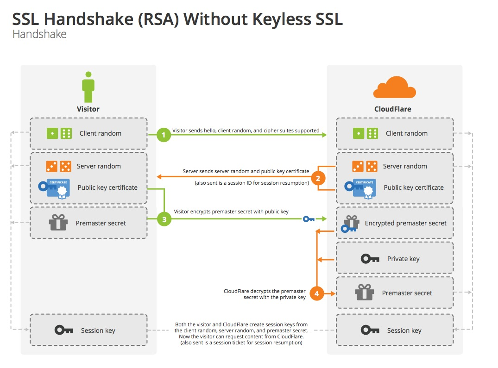
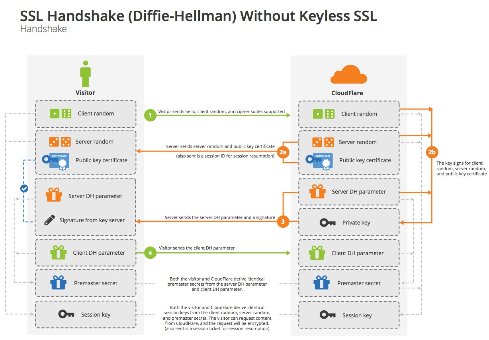

# 008 TLS 握手协议

[Keyless SSL: The Nitty Gritty Technical Details](https://blog.cloudflare.com/keyless-ssl-the-nitty-gritty-technical-details/) 是 Cloudflare 发布 Keyless SSL 服务（即无需私钥的 HTTPS CDN 托管服务）的说明文档，它使用丰富的插图以及有条理的行文结构解释了 TLS 握手的过程。阮一峰老师也根据这篇文章编写了 [图解SSL/TLS协议](https://www.ruanyifeng.com/blog/2014/09/illustration-ssl.html) 一文。

本文将在这篇文章的基础上，结合一些其他的参考资料，整理关于 TLS 握手过程的描述。

## 概述

TLS 握手一般分为 RSA 握手与 DH 握手，这两种握手的区别在于采用的加密套件（Cipher suite）的不同，这些概念将会在后面一一解释。

## RSA 握手


> 图：RSA 握手过程

首先解释一下图中这些陌生的概念。

### 概念

1. **加密套件（Cipher suite）**：这是一个由一组加密算法的名称组成的唯一标识符，在上图第 1 步中，用于客户端向服务端询问 TLS 通信采用的加密方案。以一个 RSA 握手的 Cipher suite 为例：

```
TLS_RSA_WITH_AES_128_GCM_SHA256
```

Cipher suite 的结构一般由四个算法组成：

- 一个密钥交换（Key Exchange）算法，一般是一个非对称加密算法，用于图中客户端使用公钥加密预主密钥（Premaster secret），服务端使用私钥解密的过程。在例子中就是 RSA，表示采用的是 RSA 算法
- 一个认证（Authentication）算法，一般是一个非对称加密算法，在例子中仍是 RSA（在 RSA 握手中，密钥交换与身份认证使用同一组密钥，它们都是由 RSA 算法生成，只有在 DH 握手中才会使用两种不同的加密算法生成两组密钥去分别做这两件事，“一对密钥只做一件事情”能够保证协议的[前向安全性（Perfect forward secrecy）](https://zh.wikipedia.org/wiki/%E5%89%8D%E5%90%91%E4%BF%9D%E5%AF%86)。更详细的内容会在 DH 握手的章节中进一步说明）
- 一个加密（Encryption）算法，一般是一个对称加密算法，以握手生成的 Session key 为公钥，加密来自应用层的消息体。在例子中是 AES_128_GCM，表示采用基于 [GCM 分组](https://zh.wikipedia.org/wiki/%E5%88%86%E7%BB%84%E5%AF%86%E7%A0%81%E5%B7%A5%E4%BD%9C%E6%A8%A1%E5%BC%8F#%E4%BC%BD%E7%BE%85%E7%93%A6/%E8%A8%88%E6%95%B8%E5%99%A8%E6%A8%A1%E5%BC%8F%EF%BC%88GCM%EF%BC%89) 的 128 位 AES 加密
- 一个消息认证码（Message authentication code，缩写为 MAC）算法，一般是一个散列（Hash）函数，所以通常又称为 HMAC，用于对内容进行数字签名（digital signature）即验证消息完整性，以及进行对端的身份验证。在例子中为 SHA256，表示采用 256 位的 SHA 算法。

2. **客户端随机数（Client random）**：这是一个由客户端生成的 32 字节序列，在每次连接中都是唯一的，一般应该以 4 位的时间戳 + 28 位的随机字节组成，这类随机数一般叫做 [nonce](http://en.wikipedia.org/wiki/Cryptographic_nonce)

3. **服务端随机数（Server random）**：与客户端随机数相同，唯一的区别就是，它是由服务端生成的

4. **预主密钥（Pre-master secret）**：这是一个 48 字节的 blob 数据，一般是结合客户端随机数与服务端随机数，使用伪随机函数（Pseudorandom Function）生成的

5. **会话密钥（Session key）**：这是 TLS 握手的最终目的，在握手的最后，客户端与服务端都能够拥有这个 Session key，因此可以将其作为对称加密的密钥，对双方的信息进行加解密

解释完概念，下面来梳理一下握手的具体过程：

### 过程梳理

1. **Client Hello**：客户端发送一条 Hello 信息发起握手，消息包含客户端要使用的 TLS 协议版本、Client random、Cipher suite、以及一些其他的必要信息
2. **Server Hello**：服务端收到客户端的 Hello 信息，根据信息中提供的加密套件列表，决定最终的握手类型。最后返回给客户端一条 Server Hello 消息，消息包含服务端随机数、最终确定使用的加密套件列表、以及服务端的证书（如 HTTPS 证书，证书中包含 RSA 生成的公钥和服务器的域名）
3. **客户端验证证书，生成预主密钥**：Server Hello 送来的证书经验证证书可信且站点归属正确后，客户端会将 Client random 与 Server random 结合，使用伪随机函数（Pseudorandom Function）生成 Pre-master secret，并使用证书中的公钥加密预主密钥，将其发送到服务端
4. **服务端使用私钥解密，获取预主密钥**：服务端接收到加密后的 Pre-master secret，使用之前 RSA 生成的与公钥配对的私钥进行解密，获得与客户端相同的 Pre-master secret
5. **生成 Session key**：此时客户端与服务端都通过密钥交换的过程，得到了相同的 Client random、Server random 与 Pre-master secret，客户端与服务端便可以各自通过基于 MAC 的相同计算过程推导出相同的 Session key，后续的通信内容则会使用这个 Session key 作为 AES_128_GCM 的密钥进行加解密
6. **客户端与服务端交换加密的握手结束消息，并进行 MAC 验证**：生成会话密钥（Session key）之后，客户端与服务端会使用 Session key 加密消息体，交换一次 Finish 消息，表示握手正式完成，确认双方都能正常的使用 Session key 进行加密的数据传输，同时在 Finish 消息中使用 MAC 进行数字签名验证以验证握手阶段的完整性

在这个过程中，如果发生了任何错误（如：服务端证书验证失败、完整性校验错误），则会发送一个 Alert 报文，转交给 Alert 协议层进行错误处理。

[The Illustrated TLS Connection](https://tls.ulfheim.net/) 这是 github 上找到的一个 TLS 1.2 实现，它的官网非常具体的介绍了 TLS 1.2 握手过程中的细节，细致到每一份报文的结构，以及每一个计算步骤的详细过程，非常好的扩展阅读材料。

## DH 握手


> 图：DH 握手过程

RSA 握手在密钥交换 + 身份认证的过程中使用了 RSA 生成的同一组密钥，这种做法效率比较高，相比 DH 握手使用两种不同算法的做法，省去了一半非对称运算的时间，非对称运算比对称加密的运算要慢很多，运算速度的差距通常能达到上万倍，所以不得不说 RSA 握手在性能上是有优势的。

如上一章所述，RSA 握手在密钥交换 + 身份认证的过程中使用了 RSA 生成的同一组密钥，这会带来前向安全性的问题，简单来说就是服务器私钥泄露带来的风险。在正常的通信中，客户端通过服务端给的公钥进行加密，而服务端则可以通过私钥解密客户端的信息，而问题在于，服务端的公钥是包含在服务端的证书内的，服务端的证书有效期通常会有数年之长，这意味着服务端的私钥如果泄露，那么在之前使用这个公钥加密的所有消息，全都可以被解密出来。

但如上图第 3 步中的描述，

::: tip 部分参考来源
[TLS 协议分析 与 现代加密通信协议设计](https://blog.helong.info/post/2015/09/06/tls-protocol-analysis-and-crypto-protocol-design/)

[Keyless SSL: The Nitty Gritty Technical Details](https://blog.cloudflare.com/keyless-ssl-the-nitty-gritty-technical-details/)

[TLS 1.3科普——新特性与协议实现](https://zhuanlan.zhihu.com/p/28850798)

[The Illustrated TLS Connection](https://tls.ulfheim.net/)
:::
